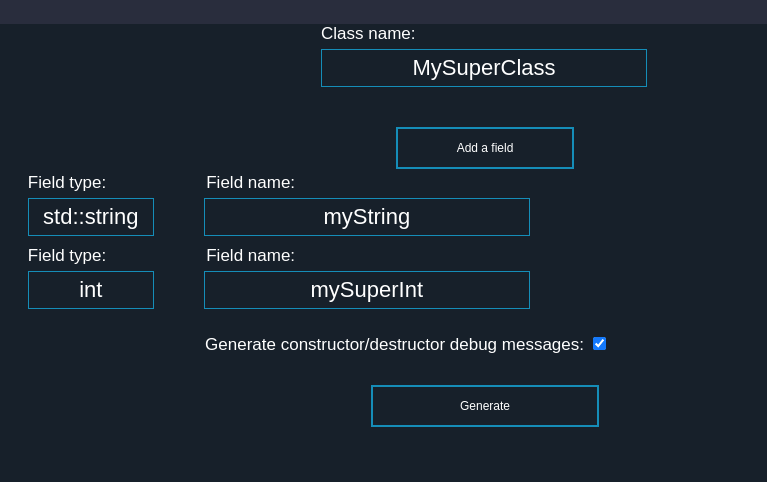

# Table of content
- [Table of content](#table-of-content)
- [Road Map](#roadmap)
- [Documentation](#documentation)
	- [Installation](#installation)
	- [Usage](#usage)
	- [Example](#example)
- [Contributing](#contributing)
# RoadMap
- Better interface
- Automaticaly add 42 header
- Give the choice to generate, or not, the getters/setters
- Give the choixe to create constructors with only certain fields
- Inheritance managing
- All the features that I find useful ;)
# Documentation
## Installation
Until we make the extension cleaner, it is not available directly on VSCode store. To install it, use the commans `code --install-extension 42CppClassGenerator-0.0.1.vsix` with the version you can find in the release. If you want to compile it from the source, you can use `vsce package` command
## Usage
- Open the generator pannel with the command `open C++ orthodox canonical class generator`
- Choose a class name (as `MySuperClass`)
- You can add all the fields you want 
- For the type, precise `std` if needed. Examples: `std::string` or `int`
- Choose a name without the `_` (as `mySuperInt`)
- You can generate debug message in constructor/destructor if the subject ask it
## Example

* This parameters will create:
	- A MySuperClass.hpp
```c
#ifndef MYSUPERCLASS_HPP
# define MYSUPERCLASS_HPP

# include <iostream>
# include <string>

class MySuperClass
{
	public:
		// Constructors
		MySuperClass();
		MySuperClass(const MySuperClass &copy);
		MySuperClass(std::string myString, int mySuperInt);
		
		// Destructor
		~MySuperClass();
		
		// Operators
		MySuperClass & operator=(const MySuperClass &assign);
		
		// Getters / Setters
		std::string getMyString() const;
		void setMyString(std::string myString);
		int getMySuperInt() const;
		void setMySuperInt(int mySuperInt);
		
	private:
		std::string _myString;
		int _mySuperInt;
		
};

#endif
```
- A MySuperClass.cpp
```c
#include "MySuperClass.hpp"

// Constructors
MySuperClass::MySuperClass()
{
	_myString = ;
	_mySuperInt = ;
	std::cout << "\e[0;33mDefault Constructor called of MySuperClass\e[0m" << std::endl;
}

MySuperClass::MySuperClass(const MySuperClass &copy)
{
	_myString = copy.getMyString();
	_mySuperInt = copy.getMySuperInt();
	std::cout << "\e[0;33mCopy Constructor called of MySuperClass\e[0m" << std::endl;
}

MySuperClass::MySuperClass(std::string myString, int mySuperInt)
{
	_myString = myString;
	_mySuperInt = mySuperInt;
	std::cout << "\e[0;33mFields Constructor called of MySuperClass\e[0m" << std::endl;
}


// Destructor
MySuperClass::~MySuperClass()
{
	std::cout << "\e[0;31mDestructor called of MySuperClass\e[0m" << std::endl;
}


// Operators
MySuperClass & MySuperClass::operator=(const MySuperClass &assign)
{
	_myString = assign.getMyString();
	_mySuperInt = assign.getMySuperInt();
	return *this;
}


// Getters / Setters
std::string MySuperClass::getMyString() const
{
	return _myString;
}
void MySuperClass::setMyString(std::string myString)
{
	_myString = myString;
}

int MySuperClass::getMySuperInt() const
{
	return _mySuperInt;
}
void MySuperClass::setMySuperInt(int mySuperInt)
{
	_mySuperInt = mySuperInt;
}


```

# Contributing
The major problem at the moment is the interface. I am not a frontend developer and my code is very ugly. Feel free to make a PR to improve the interface (in `src/GuiGenerator.ts`). But you can participate on any part of the code to propose an improvement